# Go-CRUD-API-example

### Preparation

1. Create an account in Slack
2. Go to https://api.slack.com/apps?new_app=1 and create slack app 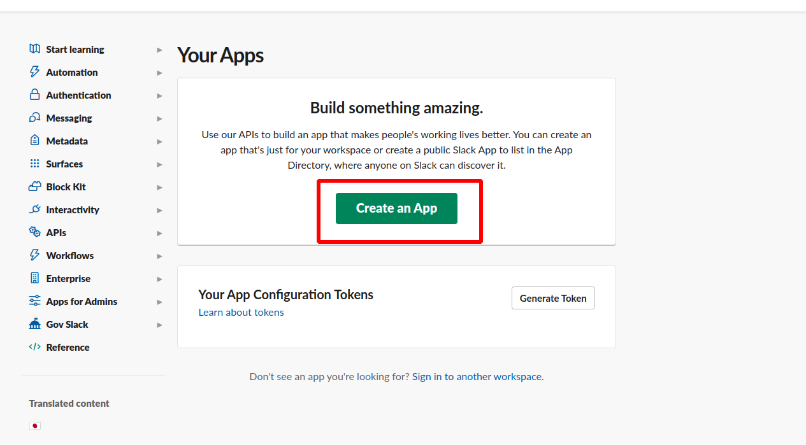 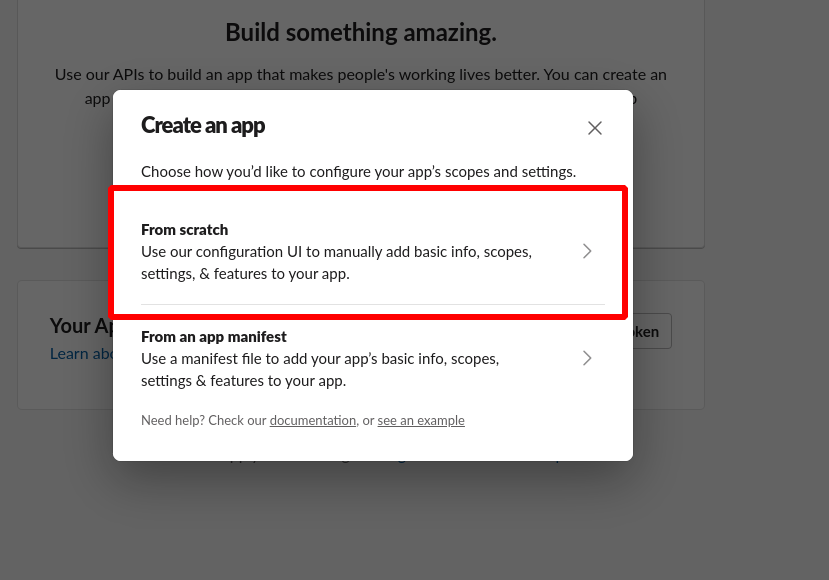 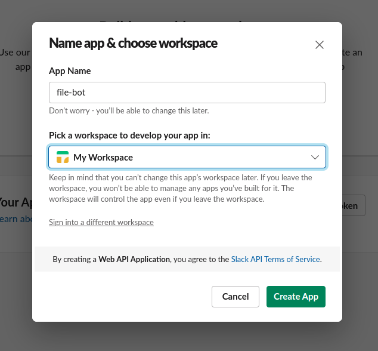
3. Enable sockets 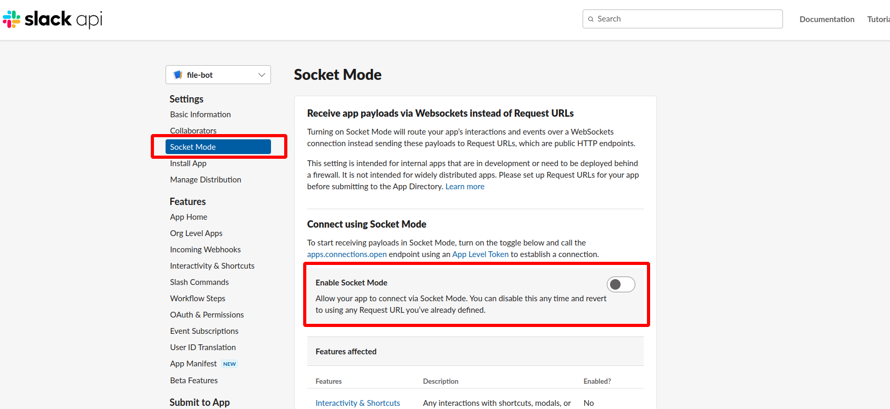 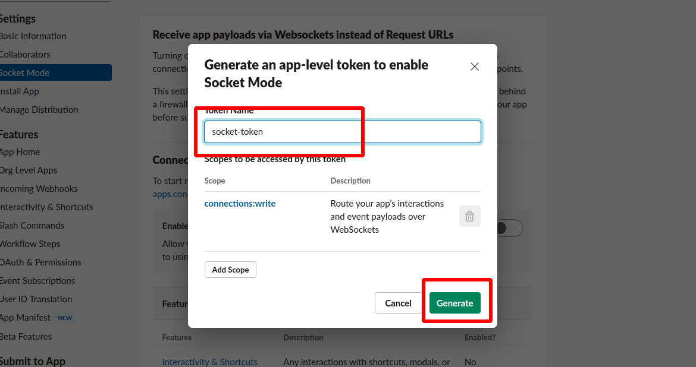
4. Enable event subscriptions 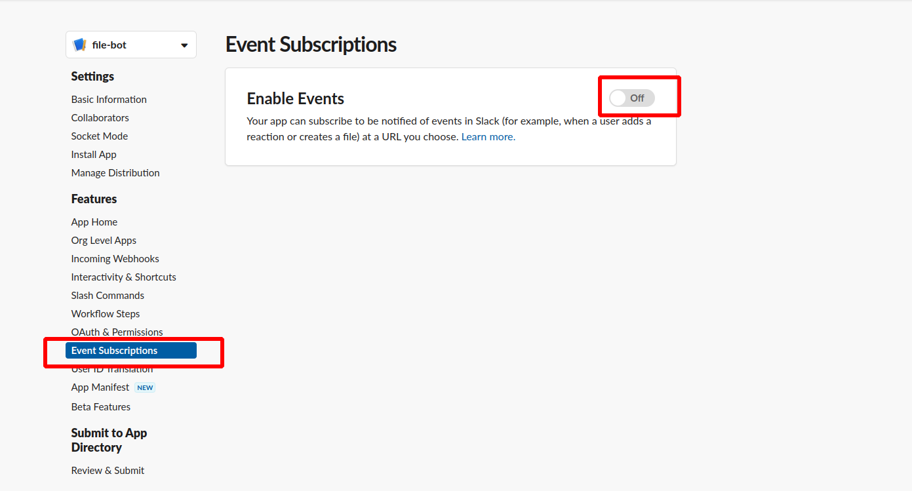
5. Configure Slack OAuth and Permissions with adding scopes 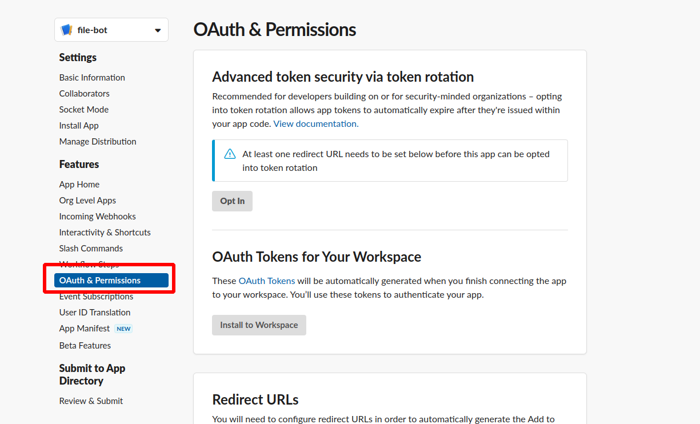 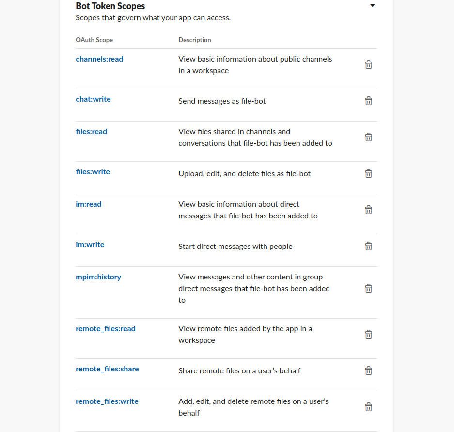 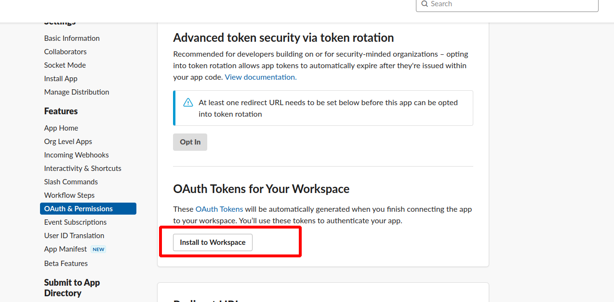
6. Get Slack Bot User OAuth Token and set SLACK_BOT_TOKEN in config file 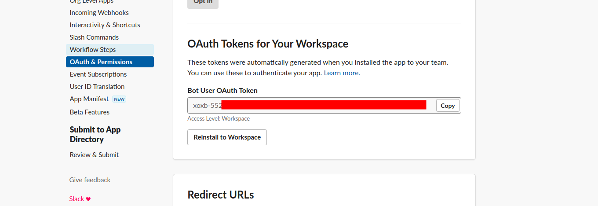
7. Get Slack Channel ID and set CHANNEL_ID in config file 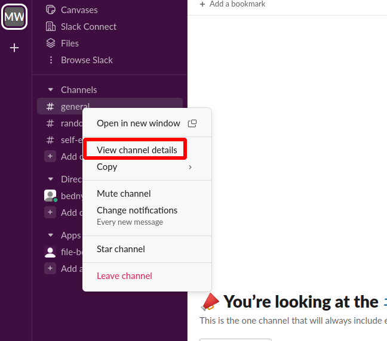 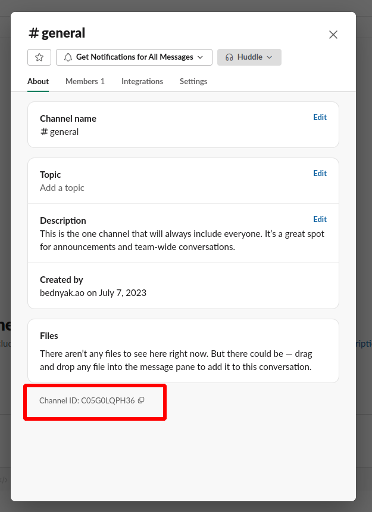
8. Add file-bot to the channel in Slack 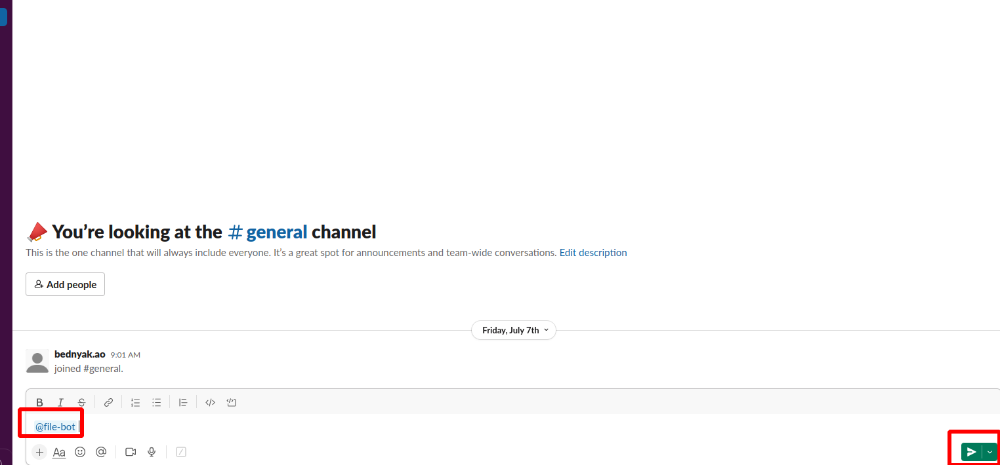 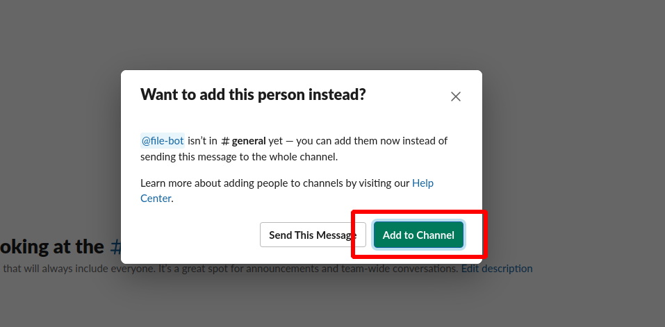

### Run
```
go run main.go
```

Go application should send 'upload-file-example.txt' to linked Slack channel 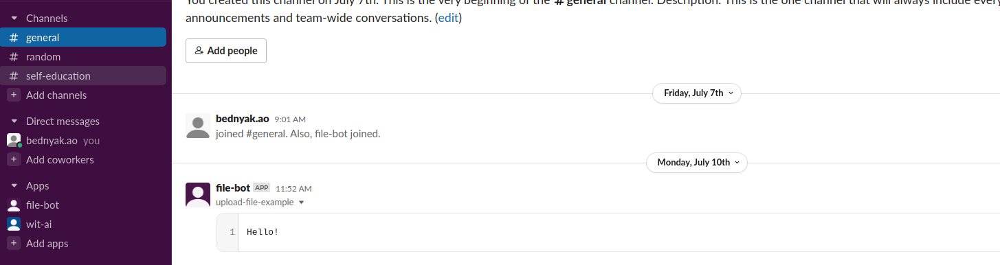